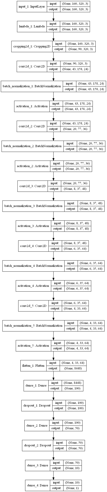

# **Behavioral Cloning** 


The goals / steps of this project are the following:
* Use the simulator to collect data of good driving behavior
* Build, a convolution neural network in Keras that predicts steering angles from images
* Train and validate the model with a training and validation set
* Test that the model successfully drives around track one without leaving the road
* Summarize the results with a written report


## Rubric Points
### Here I will consider the [rubric points](https://review.udacity.com/#!/rubrics/432/view) individually and describe how I addressed each point in my implementation.  

---
### Files Submitted & Code Quality

#### 1. Submission includes all required files and can be used to run the simulator in autonomous mode

My project includes the following files:
* model.py containing the script to create and train the model
* drive.py for driving the car in autonomous mode
* model.h5 containing a trained convolution neural network 
* writeup.md summarizing the results

#### 2. Submission includes functional code
Using the Udacity provided simulator and my drive.py file, the car can be driven autonomously around the track by executing 
```sh
python drive.py model.h5
```

#### 3. Submission code is usable and readable

The model.py file contains the code for training and saving the convolution neural network. The file implements the pipeline I used for training and validating the model, and it contains comments to explain how the code works.

### Model Architecture and Training Strategy

#### 1. An appropriate model architecture has been employed

I used the convolutional neural network described in the [NVIDIA end-to-end learning self-driving car paper](https://arxiv.org/pdf/1604.07316v1.pdf) (Bojarski et. al.)

The paper does not specify the activation function used. So I added RELU activation to each layer. RELU layers introduce nonlinearity (code lines 24 thru 32), and the data is normalized in the model using a Keras lambda layer (code line 19). The data is also cropped to remove the top 50 lines and the bottom 20 (code line 21). This is due to the assumption that the lane lines in the image are the strongest indication of the steering angle that we want the model to learn, and the lane lines do not generally appear above the horizon, or near the bottom of the image. This reduces the data that the model needs to train on and uses the neurons more efficiently to solve the problem. 

#### 2. Attempts to reduce overfitting in the model

The model did not need dropout layers in order to preform appropriately on the test track.

#### 3. Model parameter tuning

The model used an adam optimizer, so the learning rate was not tuned manually (model.py line 91).

#### 4. Appropriate training data

Training data was chosen to keep the vehicle driving on the road. I used a combination of center lane driving, lap repetition, and route reversal to gather training data.

For details about how I created the training data, see the next section. 

### Model Architecture and Training Strategy

#### 1. Solution Design Approach

The overall strategy for deriving a model architecture was to transform the vehicle state at an instant in time into a steering angle for that instant. The vehicle state is captured as a 2D color image taken from a camera placed on the vehicle center looking forward. When working with image data as an input, a convolutional neural network is a good choice. CNN's are robust against translational variation and other aspects of image data and are good for extracting high-level features like lane lines. Model architecture is an inexact science and there are near infinite CNN architectures that would solve the problem presented in this project. In the face of that indeterminance, I chose to start with an architecture designed for the purpose of vehicle control. The NVIDIA vehicle control CNN turned out to be more than sufficient for the job.

In order to gauge how well the model was working, I split my image and steering angle data into a training and validation set. My model performed perfectly literally the first time that I tried it. I did not need to collect more training data, or adjust any hyper-parameters. I was completely shocked and spent 10 minutes making sure I wasn't just playing back the training data or something.

#### 2. Final Model Architecture

The final model architecture (model.py lines 15-33) consisted of a convolution neural network with the following layers and layer sizes :



#### 3. Creation of the Training Set & Training Process

To capture good driving behavior, I first recorded three laps on track one using center lane driving. Here is an example image of center lane driving:


I then recorded the vehicle going around the track three times in the reverse direction.

After training with that data, my model was preforming perfectly on track one and I did not need to do any data augmentation like reversing or collecting recovery driving data.

After the collection process, I had about 20k data points. I then preprocessed this data by converting to RGB, normalizing to [-1,1] and cropping the top and bottom off.


I finally randomly shuffled the data set and put 20% of the data into a validation set. I used the fit_generator() method and wrote a class that implemented the Sequence interface provided by Keras. This means that during training, only the images being used in the current batch need to be loaded into memory.

I used this training data for training the model. The validation set helped determine if the model was over or under fitting. The ideal number of epochs was 5 as evidenced by the test performance on the test track. I used an adam optimizer so that manually training the learning rate wasn't necessary.
